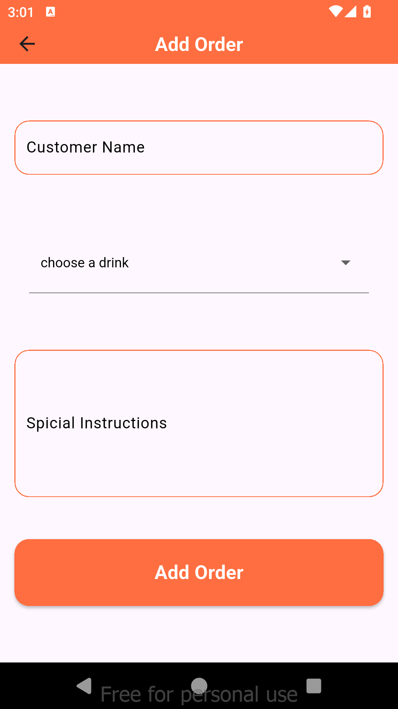
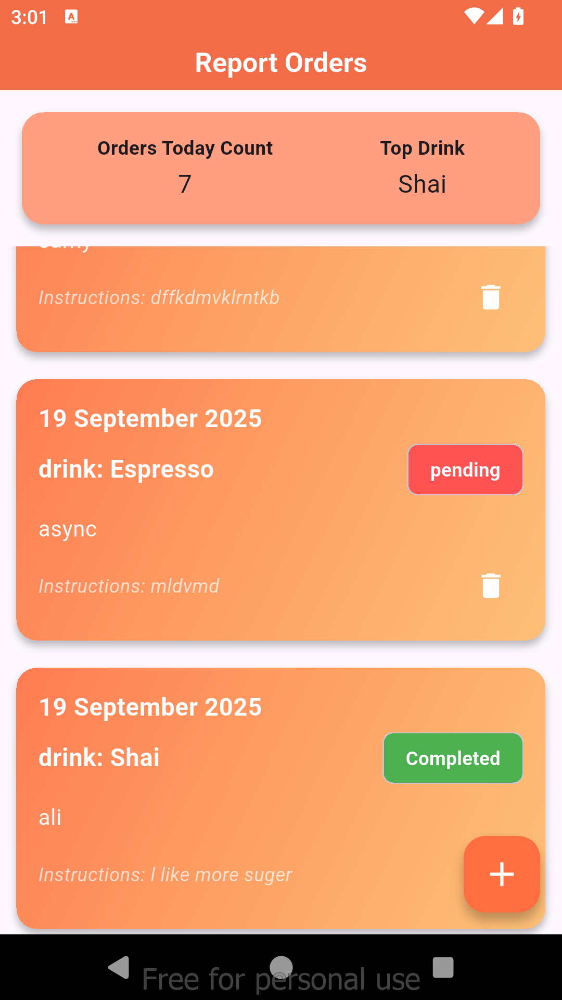

# 📱 Smart Ahwa Manager  

A Flutter application designed to help a traditional Cairo **ahwa owner** streamline daily operations. The app manages customer orders, tracks popular drinks, and generates daily sales reports — all built with **clean architecture** and **SOLID principles**.  

---

## 🚀 About the Project  

This project is part of my portfolio where I **showcase my work** as a Flutter developer.  
It demonstrates how I apply:  
- **State management with Cubit (Bloc)**  
- **SOLID principles** (Single Responsibility, Open/Closed, Liskov Substitution Principle, Interface Segregation Principle, Dependency Inversion)  
- **Core OOP concepts** (encapsulation, polymorphism, inheritance)  
- **Clean code structure** (separating Repo, Service, Cubit, UI)  

---

## ✨ Features  

- Add customer orders with:  
  - Customer name  
  - Drink type (e.g., Shai, Turkish coffee, Hibiscus tea)  
  - Special instructions (e.g., *“extra mint, ya rais”*)  
- Mark orders as **completed**  
- View a **dashboard** of all pending orders  
- Generate daily reports with:  
  - **Top-selling drinks**  
  - **Total orders served**  

---

## 🛠️ Tech Stack  

- **Flutter** (3.x)  
- **Dart**  
- **Cubit** for state management  
- **Repository pattern** for data access

---
## 🎬 Demo Video  

Check out the demo of the application in action:  

 

---
## 📂 Project Structure  

lib/
├── core/ # Helpers, widgets, constants
├── features/
│ └── orders/
│ ├── logic/
│ │ ├── model/
│ │ └── order_repos/
│ └── presentation/
│ ├── manager/ 
| | ├── order_cubit/ 
| ├── views/
│ └── widgets/
│ └── main.dart

---
## ✨ Features & Screenshots  

### 1. Add Customer Order  
  

### 2. Orders Dashboard & Daily Report 
  

- Local storage (**Sqflite**)  

---
